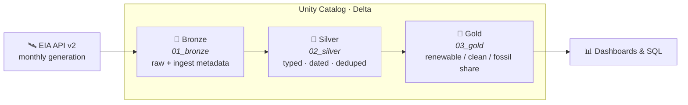

<div align="center">

# ⚡ Energy Transition ETL

### Tracking the US shift to clean power — a Databricks lakehouse from raw API to insight

[](https://www.databricks.com/)
[](https://spark.apache.org/)
[](https://delta.io/)
[](https://docs.databricks.com/dev-tools/bundles/)
[](https://www.eia.gov/opendata/)
[](LICENSE)

*Bronze → Silver → Gold pipeline that ingests 11 years of US electricity generation,
classifies every fuel, and quantifies the renewable & clean-energy transition.*

</div>

---

## 📈 The headline

<div align="center">

</div>

> Renewables roughly **doubled** their share of US electricity in a decade — **13% → 25%** —
> while fossil generation fell from **66% → 57%**. Clean power (renewable + nuclear) now sits near **43%**.
> The sawtooth is real: renewable output peaks every spring (wind + hydro) and dips in late summer.

## 🔍 What the data says

| Metric (national)            | 2015  | 2025  | Δ        |
|------------------------------|-------|-------|----------|
| Renewable share              | 13.2% | 24.6% | **+11.4 pts** |
| Clean share (renew + nuclear)| 33.6% | 43.1% | +9.5 pts |
| Fossil share                 | 66.3% | 57.1% | −9.2 pts |

**Leaders are far ahead of the average** — a handful of states already run majority-renewable grids:

<div align="center">

</div>

*Analysis notebook-ready: every number above comes straight from the gold tables this pipeline builds.*

---

## 🖥️ Live on Databricks — dashboard + interactive app

Everything stays in one platform (no separate BI tool). The pipeline feeds an **AI/BI dashboard**
and a **Streamlit "what-if" app**, both deployed as code via the Asset Bundle.

| | What it is | Link |
|---|---|---|
| 📊 **AI/BI Dashboard** | KPIs + trend + top-states, published with embedded credentials | [`/dashboardsv3/…/published`](https://dbc-036c0f5b-a5d8.cloud.databricks.com/dashboardsv3/01f167fb84e01d88acaf62a3e633ad3e/published) |
| 🎛️ **What-If App** | Model renewable growth scenarios → year the grid hits a milestone | [`energy-transition-whatif…`](https://energy-transition-whatif-4258774216266378.aws.databricksapps.com) |

The dashboard **embeds into any site** (e.g. my portfolio) via iframe — see
[`dashboards/EMBED.md`](dashboards/EMBED.md) for the React/HTML snippet and the one-time
domain-whitelist step.

```tsx
<iframe src="https://dbc-036c0f5b-a5d8.cloud.databricks.com/embed/dashboardsv3/01f167fb84e01d88acaf62a3e633ad3e"
        width="100%" height="800" title="US Energy Transition" />
```

> **Access note:** published dashboards/apps require a workspace login by default. A no-login
> public view needs an account-admin embedding/whitelist setting (see `EMBED.md`).

---

## 🏗️ Architecture

A classic **medallion lakehouse** — each layer is one notebook, wired into a dependent job DAG.



| Layer  | Notebook         | Output table(s)                                          | Job task |
|--------|------------------|----------------------------------------------------------|----------|
| 🥉 Bronze | `01_bronze.py` | `bronze_eia_generation` — raw API rows + ingest metadata | `bronze` |
| 🥈 Silver | `02_silver.py` | `silver_generation` — typed, month-dated, deduped        | `silver` |
| 🥇 Gold   | `03_gold.py`   | `gold_transition_trend`, `gold_generation_mix_state`     | `gold`   |

### Engineering decisions worth calling out
- **No double-counting.** EIA returns overlapping fuel codes (`ALL`, `REN`, `FOS`, sub-fuels…).
  The gold layer reads EIA's own **aggregate codes** rather than summing sub-fuels — the metrics
  reconcile exactly to the `ALL` total.
- **Idempotent.** Every layer is a full `overwrite` refresh; rerun any time, same result.
- **Self-sufficient DAG.** Bronze creates the catalog/schema, so the job runs cold with no manual setup.
- **Secrets stay out of git.** EIA key lives in a Databricks secret scope, read via `dbutils.secrets.get`.

---

## 🧱 Stack

`Databricks` · `Unity Catalog` · `Delta Lake` · `PySpark` · `Databricks Asset Bundles` · `EIA Open Data API v2`

## 🚀 Run it

```bash
# 1. Auth (profile-based, no tokens in repo)
databricks auth login --host https://dbc-036c0f5b-a5d8.cloud.databricks.com

# 2. EIA key into the secret scope  (free key: eia.gov/opendata/register.php)
databricks secrets create-scope energy_transition
databricks secrets put-secret  energy_transition eia_api_key

# 3. Deploy + run the bronze→silver→gold DAG
databricks bundle validate
databricks bundle deploy -t dev
databricks bundle run energy_transition_etl -t dev
```

Or open `notebooks/00 → 03` in VS Code and use the Databricks extension's **Run file on Databricks**.

### Sample query
```sql
SELECT date_format(period_date, 'yyyy') AS yr,
       round(avg(renewable_share) * 100, 1) AS renewable_pct
FROM   main.energy_transition.gold_transition_trend
GROUP  BY 1 ORDER BY 1;
```

### Regenerate the charts
```bash
python src/energy_transition/make_charts.py   # reads gold extracts → assets/*.png
```

---

## 🗂️ Repo layout
```
databricks.yml                          # bundle: dev/prod targets, variables
resources/energy_transition_etl.job.yml # 3-task DAG (bronze→silver→gold)
resources/dashboard.yml · app.yml       # AI/BI dashboard + Streamlit app as code
notebooks/00_setup.py … 03_gold.py      # the pipeline
dashboards/energy_transition.lvdash.json# dashboard definition + EMBED.md
app/app.py · app.yaml                    # interactive what-if Databricks App
src/energy_transition/make_charts.py    # README visualizations
assets/                                 # rendered charts
CLAUDE.md                               # context brief for AI assistants
```

## 📜 License
MIT — see [LICENSE](LICENSE). Data courtesy of the [US EIA](https://www.eia.gov/opendata/), public domain.
